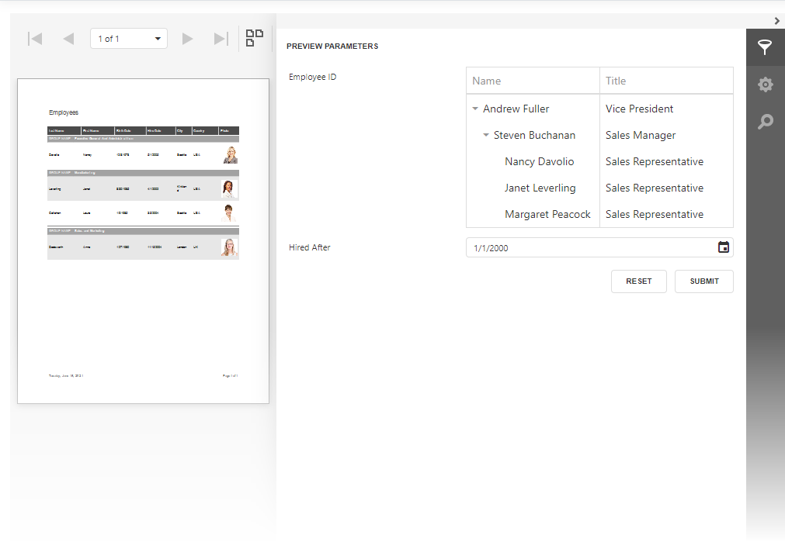

# Customized Parameter Editor in Web Reporting Controls (ASP.NET Core)

This example demonstrates how to customize a standard parameter editor and add a custom editor for a standard parameter type. 

## Files to look at

- [HomeController.cs](CS/ParameterEditorAspNetCoreExample/Controllers/HomeController.cs)
- [Viewer.cshtml](CS/ParameterEditorAspNetCoreExample/Views/Home/Viewer.cshtml)
- [Designer.cshtml](CS/ParameterEditorAspNetCoreExample/Views/Home/Viewer.cshtml)

